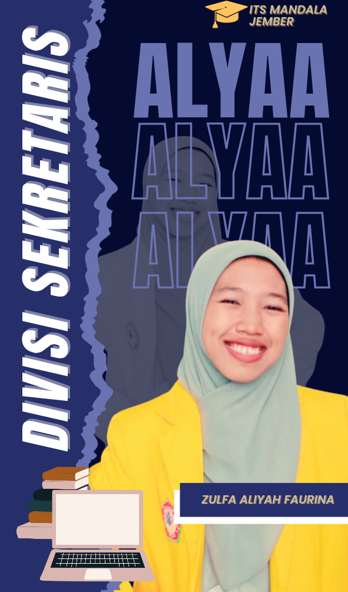
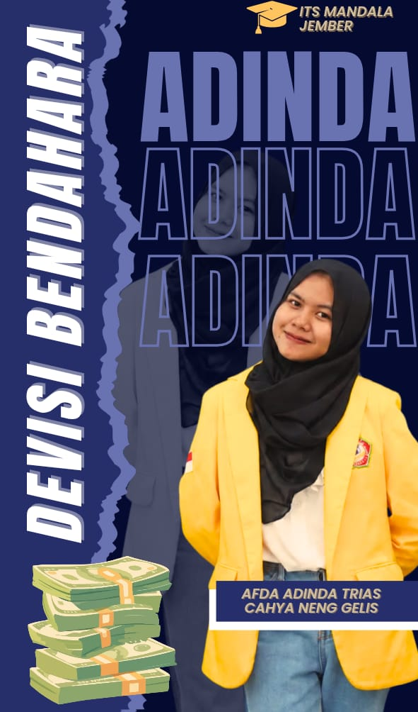
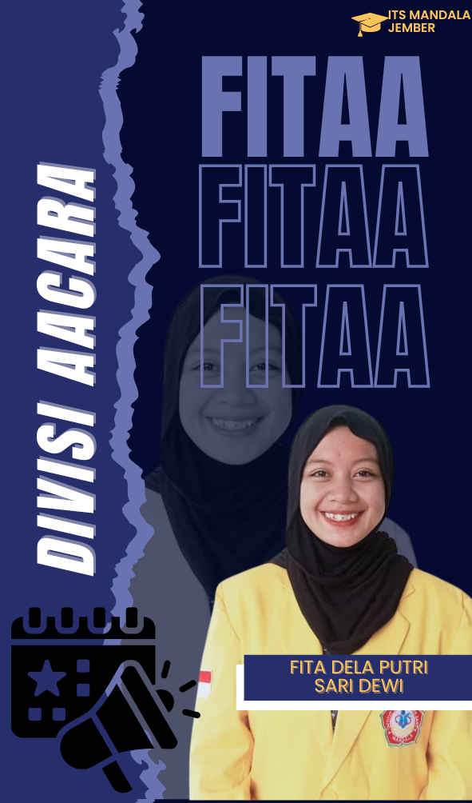
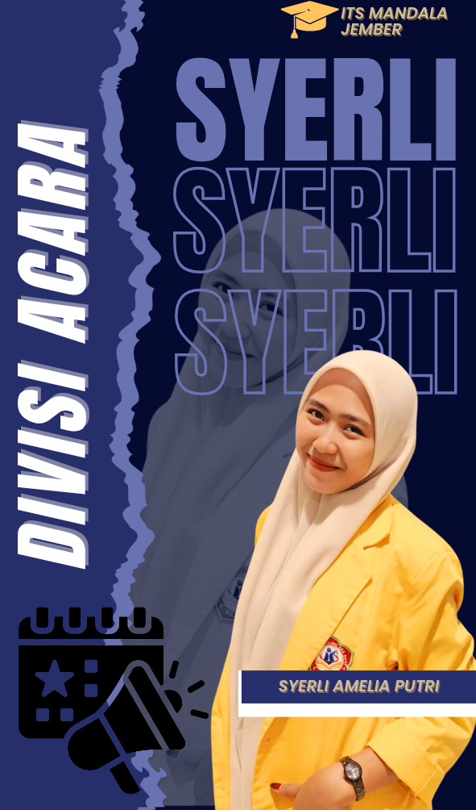
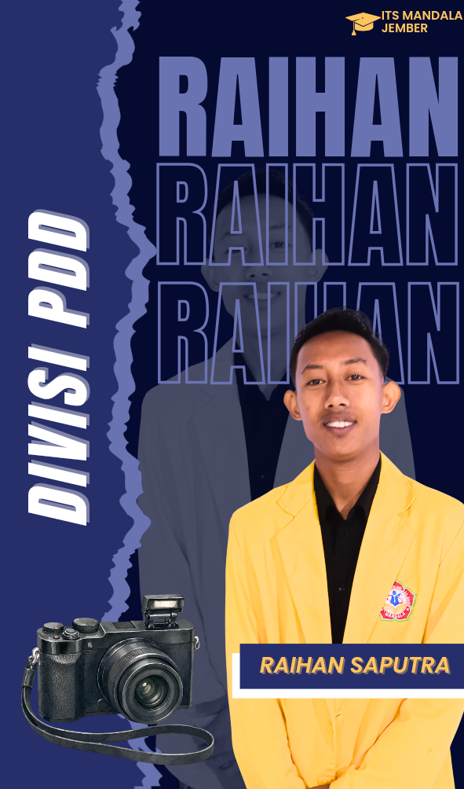

# 🌾 Website Resmi Desa Grenden

### KKN Reguler ITS Mandala Jember — Desa Grenden, Kec. Puger, Kab. Jember 2026

[](https://art-history-hub--rizkihabibi342.replit.app)
[](.)
[](.)
[](.)

---

## 🖼️ Banner KKN

<p align="center">
  
</p>

<p align="center">
  <a href="https://www.instagram.com/kkn_desagrendenpuger">
    
  </a>
  &nbsp;
  <a href="https://www.tiktok.com/@kkn_desagrendenpuger">
    
  </a>
</p>

---

## 👥 Tim Pengurus KKN

### 🎖️ Koordinator Desa & Pengurus Inti

<table align="center">
  <tr>
    <td align="center" width="200">
      <br/>
      <b>Rafi Afandi</b><br/>
      <sub>🎖️ Koordinator Desa</sub><br/>
      <sub>Ekonomi Pembangunan</sub><br/>
      <sub>NIM: 23020066</sub>
    </td>
    <td align="center" width="200">
      <br/>
      <b>Zulfa Aliyah Faurina</b><br/>
      <sub>📋 Sekretaris</sub><br/>
      <sub>Manajemen</sub><br/>
      <sub>NIM: 23030021</sub>
    </td>
    <td align="center" width="200">
      <br/>
      <b>Afda Adinda Trias C.N.G.</b><br/>
      <sub>💰 Bendahara</sub><br/>
      <sub>Akuntansi</sub><br/>
      <sub>NIM: 23040022</sub>
    </td>
  </tr>
</table>

### 🎪 Divisi Acara

<table align="center">
  <tr>
    <td align="center" width="200">
      <br/>
      <b>Fita Dela Putri Sari Dewi</b><br/>
      <sub>🎪 Divisi Acara</sub><br/>
      <sub>Manajemen</sub><br/>
      <sub>NIM: 23030065</sub>
    </td>
    <td align="center" width="200">
      <br/>
      <b>Syerli Amelia Putri</b><br/>
      <sub>🎪 Divisi Acara</sub><br/>
      <sub>Ekonomi Pembangunan</sub><br/>
      <sub>NIM: 23020065</sub>
    </td>
  </tr>
</table>

### 📢 Divisi Humas

<table align="center">
  <tr>
    <td align="center" width="200">
      <br/>
      <b>Rizki Habibi</b><br/>
      <sub>📢 Divisi Humas</sub><br/>
      <sub>Sistem & Teknologi Informasi</sub><br/>
      <sub>NIM: 23060006</sub>
    </td>
    <td align="center" width="200">
      <br/>
      <b>Lu'lu' Indallah Sari</b><br/>
      <sub>📢 Divisi Humas</sub><br/>
      <sub>Manajemen</sub><br/>
      <sub>NIM: 23030030</sub>
    </td>
  </tr>
</table>

### 📸 Divisi PDD (Publikasi, Dekorasi & Dokumentasi)

<table align="center">
  <tr>
    <td align="center" width="200">
      <br/>
      <b>Anis Suntoni</b><br/>
      <sub>📸 Divisi PDD</sub><br/>
      <sub>Manajemen</sub><br/>
      <sub>NIM: 23030075</sub>
    </td>
    <td align="center" width="200">
      <br/>
      <b>Maliki Septa Pratama</b><br/>
      <sub>📸 Divisi PDD</sub><br/>
      <sub>Ekonomi Pembangunan</sub><br/>
      <sub>NIM: 23020010</sub>
    </td>
    <td align="center" width="200">
      <br/>
      <b>Reyhan Saputra</b><br/>
      <sub>📸 Divisi PDD</sub><br/>
      <sub>Ekonomi Pembangunan</sub><br/>
      <sub>NIM: 22020068</sub>
    </td>
  </tr>
</table>

---

## 🤖 Fitur AI — Asisten Desa Grenden

Website ini dilengkapi fitur **Asisten AI berbasis Gemini Flash** yang dapat menjawab pertanyaan seputar Desa Grenden, program KKN, dan layanan desa.

> **Setup:** Tambahkan `VITE_GEMINI_API_KEY=your_api_key` di file `.env` untuk mengaktifkan fitur AI.

---

## 🗂️ Struktur Folder

```
KKN/
├── aplikasi/
│   ├── server-api/          # Backend Express.js + TypeScript
│   │   └── src/
│   │       ├── routes/      # API: anggota, auth, health
│   │       ├── middlewares/ # Auth middleware
│   │       └── app.ts
│   └── website-desa/        # Frontend React + Vite + TailwindCSS
│       └── src/
│           ├── assets/
│           │   └── gambar/
│           │       ├── banner/       # Banner KKN
│           │       ├── desa/         # Foto desa & alam
│           │       ├── foto-anggota/ # Foto resmi 10 anggota
│           │       └── kegiatan/     # Dokumentasi kegiatan
│           ├── components/  # Komponen UI reusable
│           ├── lib/         # API client & utilities
│           └── pages/       # 9 halaman website
├── pustaka/
│   ├── database/            # Drizzle ORM + MySQL schema
│   └── validasi-api/        # Zod validation schemas
├── skrip/
│   ├── setup-db.sql         # Setup & seed database
│   └── src/seed.ts          # Data awal 10 anggota KKN
├── .env                     # Environment variables (lokal)
└── README.md
```

---

## 📄 Halaman Website

| Halaman | URL | Keterangan |
|---------|-----|------------|
| Beranda | `/` | Hero, statistik, profil, sejarah, galeri, anggota |
| Profil Desa | `/profil` | Profil lengkap Desa Grenden |
| Visi & Misi | `/visi-misi` | Visi misi dan program kerja |
| Anggota KKN | `/anggota-kkn` | 10 anggota dikelompokkan per divisi |
| Galeri | `/galeri` | Dokumentasi foto kegiatan |
| Berita | `/berita` | Berita dan kegiatan terbaru |
| PPID | `/ppid` | Informasi publik desa |
| Konten Sosmed | `/konten-sosmed` | Konten media sosial KKN |
| Admin | `/admin` | Panel kelola data anggota (login) |

---

## 🚀 Cara Menjalankan (Lokal)

### Prasyarat
- Node.js v18+, pnpm v9+, MySQL 8 / Laragon

### 1. Clone & Setup `.env`
```bash
git clone https://github.com/rizki-habibi/KKN-leguler-puger-grenden.git
cd KKN-leguler-puger-grenden
```

Buat file `.env`:
```env
DATABASE_URL=mysql://root@127.0.0.1:3306/kkn_grenden
SESSION_SECRET=grenden-kkn-secret-2026
ADMIN_PASSWORD=grenden2025
PORT=5000
FRONTEND_PORT=3000
VITE_GEMINI_API_KEY=masukkan_api_key_gemini_disini
```

### 2. Setup Database
```bash
mysql -u root -h 127.0.0.1 -P 3306 < skrip/setup-db.sql
```

### 3. Install & Jalankan
```bash
# Install dependencies
pnpm install --ignore-scripts

# Terminal 1 — Backend API (port 5000)
cd aplikasi/server-api
npx tsx src/index.ts

# Terminal 2 — Frontend (port 3000)
cd aplikasi/website-desa
npx vite --port 3000
```

### 4. Buka Browser
- **Website:** http://localhost:3000
- **API:** http://localhost:5000/api/anggota

---

## 🛠️ Tech Stack

| Komponen | Teknologi |
|----------|-----------|
| Frontend | React 19 + Vite + TailwindCSS 4 |
| Backend | Express.js 5 + TypeScript |
| Database | MySQL 8 + Drizzle ORM |
| AI | Google Gemini Flash |
| Animasi | Framer Motion |
| UI Components | shadcn/ui + Radix UI |
| Routing | Wouter |
| State | TanStack Query |
| Package Manager | pnpm workspace |

---

## 📍 Lokasi

**Desa Grenden, Kecamatan Puger, Kabupaten Jember, Jawa Timur 68164**

**Dosen Pembimbing:** Faizal Abrolillah, S.Kom., M.Kom.

---

© 2026 Tim KKN Reguler ITS Mandala Jember — Desa Grenden
